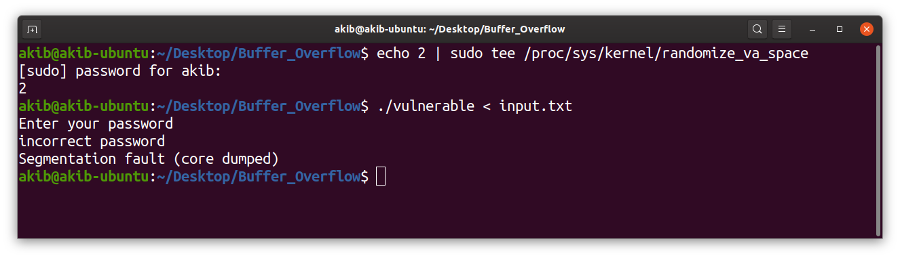

# buffer_overflow_13

//Author name: Akib Ahmed

#1. Create c file and write the code:  
 •	At first, we create a c file containing the code we are given, naming it vulnerable.c. Then we see the code in the terminal using the cat vulnerable.c command.

#2. Disabling memory randomization, enabling core dumps:  
•	Then we check the current state of randomization with the command cat /proc/sys/kernel/randomize_va_space

•	As the value is 2, that means memory randomization is true. So, we have to turn of the randomization using the following command:

•	We check that the value has actually changed:

•	Then we check ulimit:

•	After that we set ulimit to unlimited and check again:

#3. Compiling the c program:  
•	Then we compile the c program and run it by the following command which may be terminated because of the unavailability of a library function. If it is terminated then we have to install the library using the command:

•	Many packages will be installed during the whole process. After finishing, then we have to compile and run the file again:

#4. Using GNU Debugger (GDB) and Exploit Buffer:  
•	Then we enter into the gdb terminal using gdb ./vulnerable

•	First disassemble main to know the function state of main in memory: 

•	Then disassemble login to know the state of login in memory

•	Similarly, disassemble user:

•	Then execute the file and give a wrong password, so that exploit the functionalities can be easily monitored:

•	Again, disassemble login:

•	Furthermore, we will set 2 breakpoints. 
•	The 1st one will be set to the register of the scanf() function which takes input. Next time, when we run the program, a breakpoint will appear in the time of giving input.

•	The 2nd one will be in a stage, where the input is loaded and stored in a register before approaching the next call function. Thus, we can know the register, which stored the wrong password at the time we tried to login.

•	When we run the program after setting the breakpoint, we will hit the 1st breakpoint.

•	Then using x/20x $esp command we want to see the nature of the 20 registers specifically.

•	We continue our process using command c:
•	But now we got hit in breakpoint 2.

•	Then again, we see the conditions of 20 registers:

•	Then we go out of the gdb (using ctrl+shift+z) and create a text file to give input:

•	Again, we enter in gdb (using command: fg) and disassemble login:

•	Here we have to take the register value (which we get after execute ‘disassemble login’ command) of the user function. This is mainly the register, from where the user function is called. Then we have to go out of the gdb again and insert a password in the text file we created. From the next time we will use this text file as the input.  Now we will use 28 ‘A’s and a form of reverse order of the user register as the password and this input will overflow in the buffer registers. This input will be replaced in the instruction pointer (eip) which will grant the access for the user giving a long password and using the buffer overflow we will get the access granted.

•	Now, we get back in the gdb and run the file using the text we created. Then similarly we will hit the two breakpoints we created before. In the 2nd breakpoint we will find the register number we gave (after a number of A(41)’s we put in the text file). That given register is the way for us to get access to the user account.

•	We can check the register name and the work of it using the command x/i 0x565562b9. We see that it will show the user from the login function because of the buffer overflow we executed. Now if we command c to continue then we will see that the password is incorrect, but we have access to the user machine. That is our goal.

•	Now if we go out of gdb, we will be able to gain the access using the terminal command also.

•	In the beginning, we turned off the memory randomization. If we turn on that now and then run the buffer overflow attack in the terminal, we won’t be getting the access anymore.

